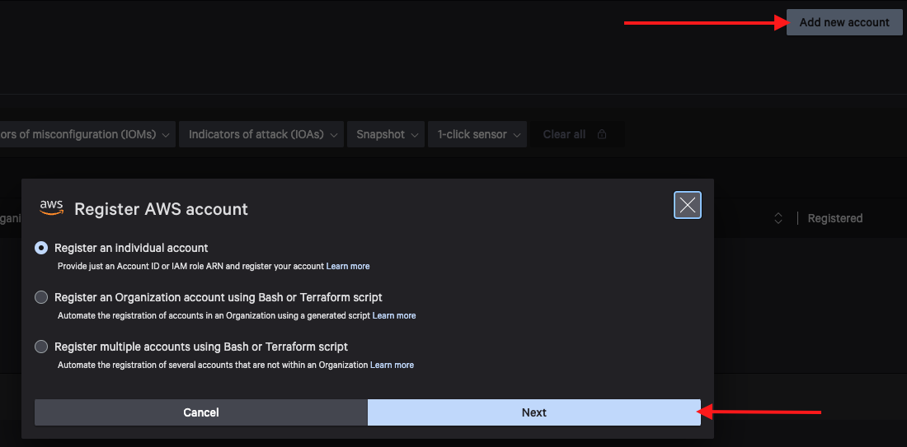
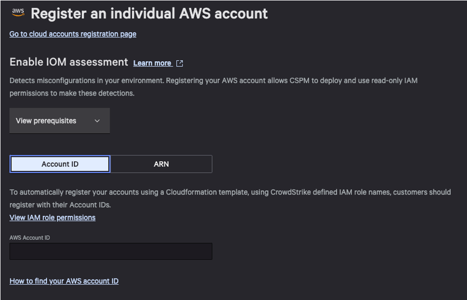
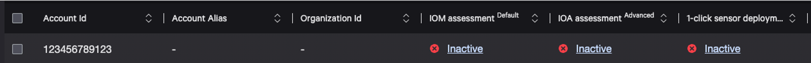
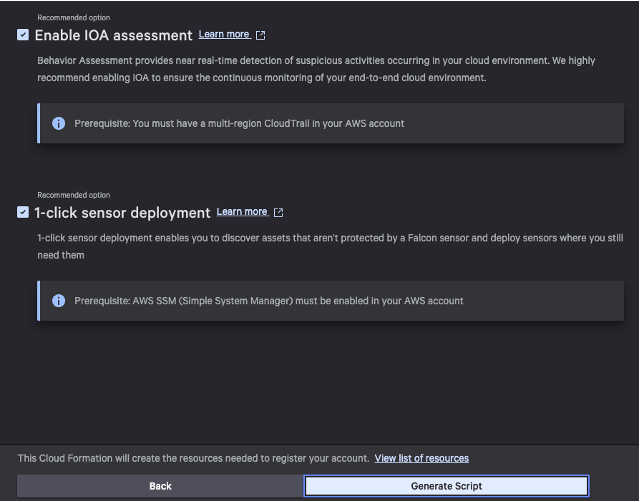

# Cloud Security Lab Series
## AWS CSPM Registration 101
### Chapter 3 - Guided Registration via Falcon Console

Now that we understand how the API works, we can review how most customers will onboard their AWS Accounts: Guided Registration via the Falcon Console.  

#### Add Account
1. Navigate to the [Cloud Account Registration page](https://falcon.crowdstrike.com/cloud-security/registration) and click **Add new account**
2. Select Register an individual account and click next.

**Note**: While most customers will use “Register an Organization”, we can only register a single account in this lab environment.  In a later chapter, we will review how this process works in an Organization context.
3. Enter your Falcon API Credentials and click next

On the Enable IOM assessment page you are presented with two options: Account ID and ARN

**Account ID** means you will not be providing a custom IAM Role ARN and the API will autogenerate the IAM Role name.  This is the equivalent of the iam_role_arn attribute in our API call earlier.
**ARN** means you will create the role in your AWS Account prior to registration.  This allows the customer to define the IAM Role name, which could be required if the customer has AWS Service Control Policies (SCPs) in place to specify role naming conventions.  If you select ARN you are presented with the required steps to create the IAM role and proceed.  For now, continue to step 4. 
4. **Select Account ID**, paste your AWS Account ID and click **next**.
  
You will see a success message in the top right.  If you instead get an error like "Account ID is already in the CrowdStrike Database".  Please complete the Cleanup phase of [Chapter 2](./chapter2.md)

You are now presented with Enable IOA assessment and 1-click sensor deployment. At this point we have effectively registered the account, just as we had with the API previously.  If you did nothing else the AWS Account ID will still show in the Cloud Account Registration page with IOM, IOA and OneClick enabled but inactive.

5. Leave both options selected and click generate script.

#### Onboarding the Account
A CloudFormation template has been generated with all of the relevant details.  You are presented with two options **Go to AWS Console** and **Copy CloudFormation link**  
- Go to AWS Console is a quick-create link that will resolve to CloudFormation/Stacks/CreateStack in your current AWS Console with the template and parameters preloaded.
- Copy CloudFormation link will copy the quick create URL with parameters preset if you want to launch the template later.  This URL will contain the Falcon API credentials in plain text so use caution when storing or sharing these links.

1. Make sure you are still currently logged into your AWS Account in another tab, then click **Go to AWS Console**

[Continue to Chapter 4](./chapter4.md)

[Back to Table of Contents](../README.md)